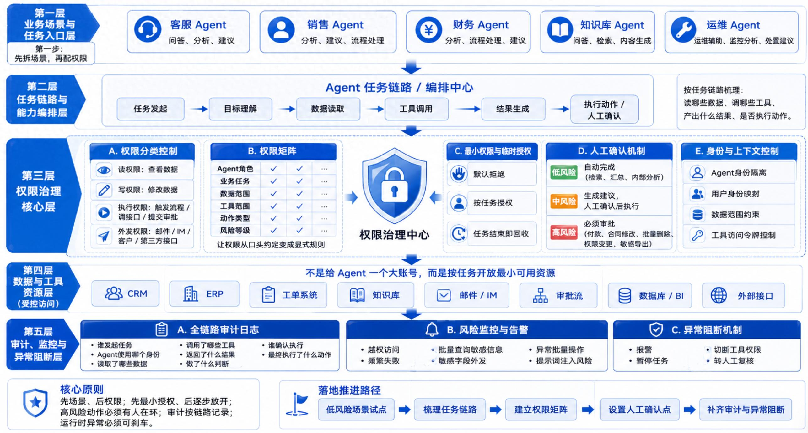

# Agent 权限设计

## 背景

企业级 AI Agent 落地通常要解决三层问题：

1. **评测体系** — 解决 Agent 能不能上线
2. **编排体系** — 解决 Agent 进入业务后任务怎么拆、流程怎么跑、工具怎么调、异常怎么处理
3. **权限与审计体系** — 解决 Agent 能不能安全地进入企业生产系统（本文主题）

传统系统里权限管的是"人"：这个账号能不能看某页面、点某按钮。但 Agent 可能连续读知识库、查 CRM、看工单、调邮件工具，最后自主生成一份客户回复——权限管理对象从"人"变成了"会自主决策的执行链路"，直接复用管理员账号或给一个"大账号"是在埋雷。

## 七步权限设计法

### 1. 先拆场景，不要先配权限

不要一上来就问"这个 Agent 需要哪些系统权限"。先把 Agent 要做的场景列清楚：

- 客服 Agent：只是回答问题、总结工单，还是可以直接关闭工单？
- 销售 Agent：只是查资料、生成跟进计划，还是可以改商机阶段、发报价邮件？
- 知识库 Agent：只是检索、生成摘要，还是可以改写知识库内容？

同一个 Agent 在不同任务里需要的权限完全不同。做设计时先画**任务链路**（读什么数据、调什么工具、产出什么、是否执行动作），而不是先画系统菜单。

### 2. 权限拆成"读、写、执行、外发"四类

| 类型 | 含义 | 风险 |
|---|---|---|
| 读 | 能否查看数据 | 低 |
| 写 | 能否修改数据 | 中 |
| 执行 | 能否触发流程、调接口、提交审批、关闭工单 | 高 |
| 外发 | 能否把内容发到邮件、客户群、IM、第三方接口 | 高 |

能读工单 ≠ 能关闭工单；能生成报价建议 ≠ 能直接发给客户。每个工具都要标清楚属于哪一类，涉及写入/执行/外发的不能按普通查询权限处理。

### 3. 建一张权限矩阵

至少包含六个维度：

- **Agent 角色**：客服 / 销售 / 财务 / 知识库 / 运维
- **业务任务**：查询、分析、生成建议、提交审批、修改记录、外发通知
- **数据范围**：客户 / 合同 / 财务 / 员工 / 项目 / 知识库数据
- **工具范围**：CRM、ERP、工单系统、知识库、邮件、审批流、数据库、BI
- **动作类型**：读、写、执行、删除、导出、外发
- **风险等级**：低 / 中 / 高

没有这张表，权限就是口头约定——演示阶段没问题，生产环境一定出问题。

### 4. 默认拒绝，按任务临时授权

Agent 默认什么都不能做，进入明确任务后才获得完成该任务所需的**最小权限**，任务结束权限随之收回。不要因为 Agent 处理过一次高权限任务就让它长期保留高权限——它会根据上下文自动行动，权限越宽，自动行动的风险越大。

### 5. 高风险动作必须人工确认

三层控制：

- **低风险**：Agent 自动完成（检索资料、汇总工单、生成内部分析）
- **中风险**：Agent 生成建议，人确认后执行（生成客户回复、草拟报价说明）
- **高风险**：Agent 不能直接执行，必须走审批（付款、合同变更、批量删除、权限调整）

目标不是让 AI 替人做所有决定，而是让 AI 把准备工作做好、把判断依据摆出来，人只在关键节点确认。

### 6. 审计日志按链路记录，而不是只记结果

需要记录完整链路：任务谁发起、Agent 用什么身份、读了哪些数据、调了哪些工具、工具返回什么、Agent 做了什么判断、是否触发人工确认、最终执行了什么动作。写入、删除、导出、外发、权限变更这些动作要有更详细的日志。审计不是为了事后甩锅，而是让 Agent 从黑箱变成可复盘的系统。

### 7. 要有异常阻断机制

生产环境里 Agent 可能连续调用失败、试图访问未授权数据、短时间批量查询敏感信息、或被外部文档里的提示词注入诱导做不该做的事。权限体系不能只是静态配置，还要有运行时监控：出现异常访问、频繁失败、批量操作、敏感字段外发、越权调用时，系统要能报警、暂停任务、切断工具权限，进入人工复核。

## 落地建议顺序

1. 选一个低风险场景（知识库问答、工单摘要、客户分析建议）
2. 画出该场景的任务链路，明确需要哪些数据和工具
3. 做权限矩阵，读/写/执行/外发分开配置
4. 设置人工确认点，尤其是外发和写入动作
5. 补齐审计日志和异常阻断机制

不要一开始就做"全能 Agent"——演示里很吸引人，生产系统里很危险。真正能上线的 Agent 不是权限最大的那个，而是**边界最清楚、流程最可控、日志最完整**的那个。

## 一句话总结

企业级 AI Agent 的权限设计，不是给它一把万能钥匙，而是给它一张清晰的工作证：在哪个场景、以什么身份、访问哪些数据、调用哪些工具、做到哪一步、什么时候必须停下来让人确认。
